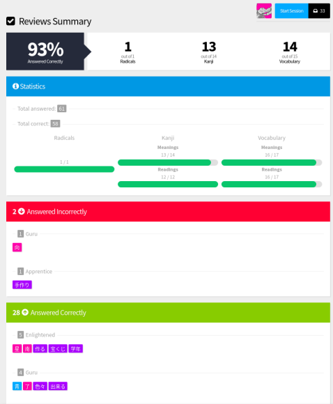

# WaniKani Review Stats

This userscript will display information about your latest review session, such as the proportion of kanji/vocabulary readings/meanings that you got wrong, and total amounts of mistakes.

## Installation

Simply follow the [instructions](https://community.wanikani.com/t/visual-guide-on-how-to-install-a-userscript/12136) on the WaniKani community forums.

## Screenshot

